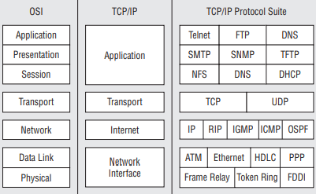

## Describe any layered process you are familiar with similar to the OSI Model

### TCP/IP Model 
TCP/IP Model, it was designed and developed by Department of Defense (DoD) in 1960s and is based on standard protocols.
It stands for Transmission Control Protocol/Internet Protocol. 
The TCP/IP protocol suite is also known as the Internet protocol suite, as TCP/IP is pretty much the backbone of the Internet (and the majority of all networks outthere
The TCP/IP model is a concise version of the OSI model. It contains four layers, unlike seven layers in the OSI model. The layers are:

* Application Layer
* Transport Layer
* Internet Layer
* Network Interface/Link Layer

## The TCP/IP Model from Top to Bottom

**Application layer** - The Application layer corresponds to the Application, Presentation, and Session layers of the OSI reference model. Users initiate a process that will use an application to access network services Applications work with protocols at the Transport layer in order to pass data in the form needed by the transport protocol chosen. On the receiving end, the data is received by the lower layers and passed up to the application for processing for the destination end user. This layer concerns itself with the details of the application and its process, and not so much about the movement of data. This is what separates this upper layer from the lower three layers.  

**Transport layer** - The Transport layer corresponds to the Transport layer of the OSI reference model. Two primary protocols operate at this layer: Transmission Control Protocol (TCP), and the User Datagram Protocol (UDP). This layer serves the Application layer and is responsible for data flow between two or more nodes within a network

**Internet layer** - It corresponds to the Network layer of the OSI reference model. This layer is also known as the Network layer. The Internet layer is responsible for the delivery of packets through a network. All routing protocols (RIP, OSPF, IP, etc.) are members of this layer. Nodes that perform functions at this layer are responsible for receiving a datagram, determining where to send it to, 2 and then forwarding it toward the destination. When a node receives a datagram that is destined for the node, this layer is responsible for determining the forwarding method for information in the packet. Finally, this layer contains protocols that will send and receive error messages and control messages as required.

**Network Interface layer** - The Network Interface layer corresponds to the Physical and Data Link layers of the OSI reference model. This layer is also often referred to as the Link layer or the Data Link layer.The Network Interface layer is responsible for the device drivers and hardware interfaces that connect a node to the transmission media.

