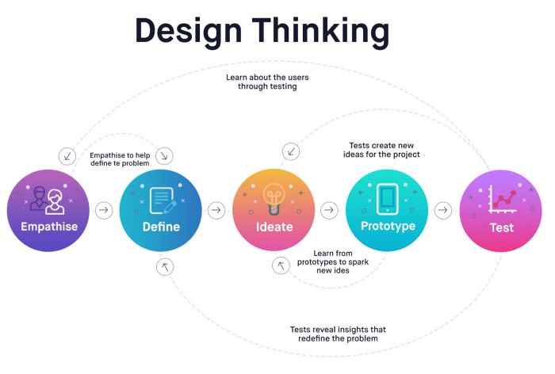

### Name: Adebola Oluwabusayo Jonathan
### Email: jonathanadebola@gmail.com
### Candidate ID: 044

### Task: Write an article on UI/UX Fundamentals, submit as a markdown file in your student folder, raise a PR.

# ARTICLE

UI/UX has become a major part of every profession and the demand for it is constantly on a rise each day.

Before we continue, let’s quickly define both UI and UX.

User interface design or user interface engineering is the design of user interfaces for machines and software, such as computers, home appliances, mobile devices, and other electronic devices, with the focus on maximizing usability and the user experience (Wikipedia).

Don Norman, a cognitive scientist and co-founder of the **Nelsen Norman Group Design Consultancy,** is credited with coining the term “user experience” in the late 1990s. Here’s how he describes it:

> User experience encompasses all aspects of the end-user’s interaction with the company, its services, and its products.

Understanding and mastering of the basics of visual design is very important before you jump into UI/UX design. This is essential to become a skilled UI/UX designer. 

**Let me give you some fundamental principles of UI/UX that every designer need to become familiar with:**

1.	Color: every UI/UX designer needs to be fully aware of color vocabulary, fundamentals and psychology of color.
2.	Grid Systems: This is an import part which every designer should master; what they are and how they can be applied to every design process
3.	Composition and balance
4.	Typography
5.	Contrast 

**Design Thinker**

Design Thinking is the process of designing product from perspective how it will be understood and used my users rather than requiring users to adopt their behaviors in order to learn how to use the system (uxdesign.cc)

**UX Design Process**
The UX design process can be divided into four key phases: *user research, design, testing, and implementation.* While the UX design process does typically take place in that order, it’s important to note that UX is an iterative process.

1. User Research: This is extremely inportant aspect of UX process. It is the starting point for a UX design project. Researches helps us to determine the user, their behavior, their goals and their needs. Alot of information a gathered and alot of questions need to be provided answers to in this stage.

2. Design: The next step in the UX design process is to create wireframes and prototypes. This gives you something tangible to test on real and potential users, which is crucial in making sure that your designs are usable.

3. Testing: Like User Research, Testing is a fundamental part of the UX designer’s job and a core part of the overall UX design process. UX designers test because it allows them to improve upon the original product or site design and to see if the changes they made during the ‘design’ phase stand up to scrutiny.

4. Implementation: This is the part where the UX design process is implemented. As a UX designer, it is your responsibility to implement, and advocate for, the UX design process.

**References:**
[What Is the UX Design Process? A Complete, Actionable Guide](https://careerfoundry.com/en/blog/ux-design/the-ux-design-process-an-actionable-guide-to-your-first-job-in-ux/#ux-processes-explain-user-research)

[User interface design](https://en.wikipedia.org/wiki/User_interface_design)

[Master the basics of visual: how to become a self-taught UI/UX designer](https://uxdesign.cc/how-to-become-a-ui-ux-designer-self-taught-8a511170fd7c)